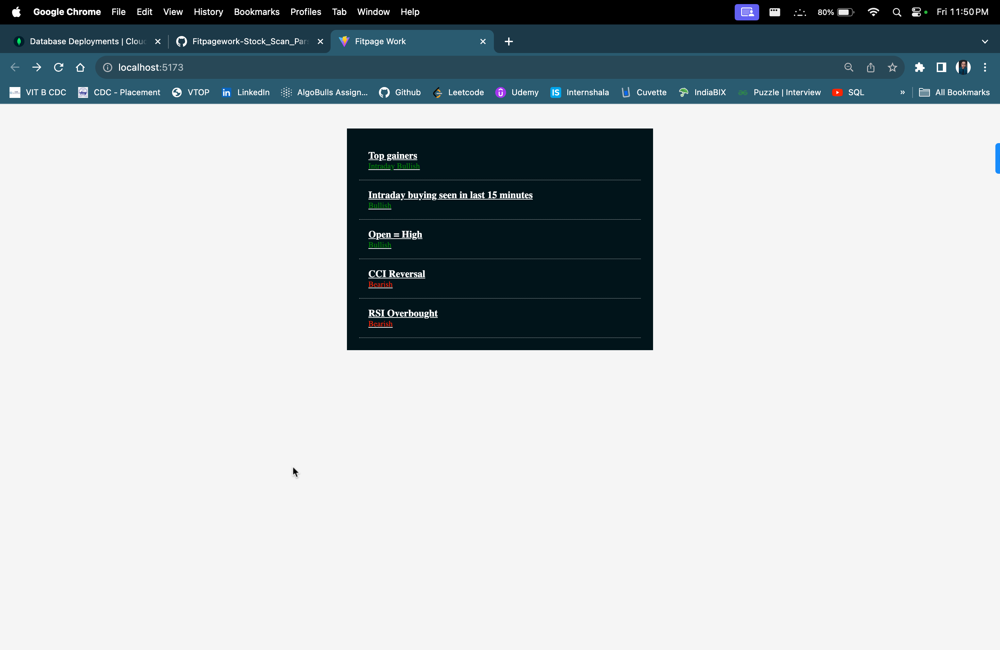
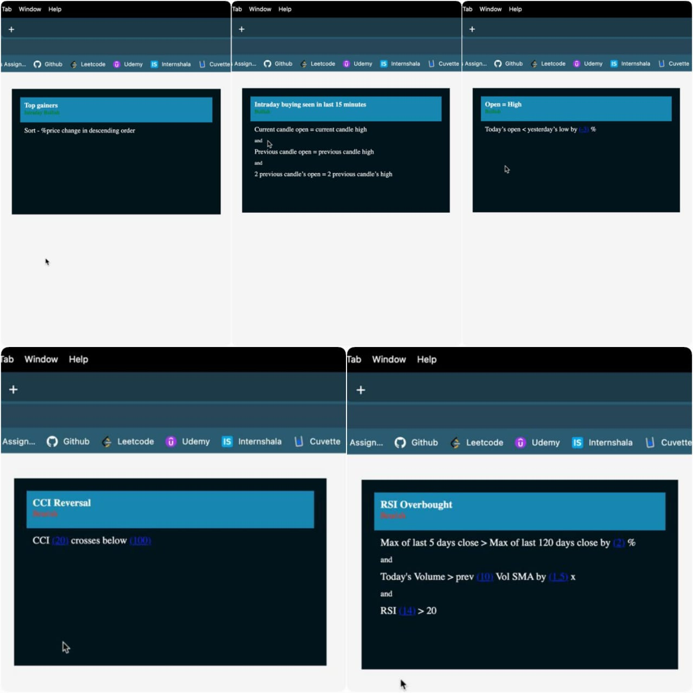

# FitPage Work (Stock Scan Parser)

Welcome to FitPage Work, a robust web application designed to provide users with a comprehensive list view of stock market scans. Built with ReactJs, Vite, Typescript, MongoDB, ExpressJs, and NodeJs.




## Live Link
https://fitpagework.vercel.app


## Project Overview
- The web application displays a list view of stock market scans with multiple sub-criteria.
- Sub-criteria can be plain text or include variable parameters, and the variable type/values are provided in the data.

## Technologies Used
- **Frontend:**
  - Framework: ReactJs
  - Starter App: Vite
  - Additional: Typescript
- **Backend:**
  - Runtime: NodeJs
  - Framework: ExpressJs
  - Database: MongoDB

## Getting Started
To run the project locally, follow these steps:

1. Install Node Modules:
    ```
    npm install
    ```

2. Run on localhost:
    ```
    npm run dev
    ```

    Make sure you are in the correct directory, i.e., the Client Folder
    ```
    cd Client
    ```


